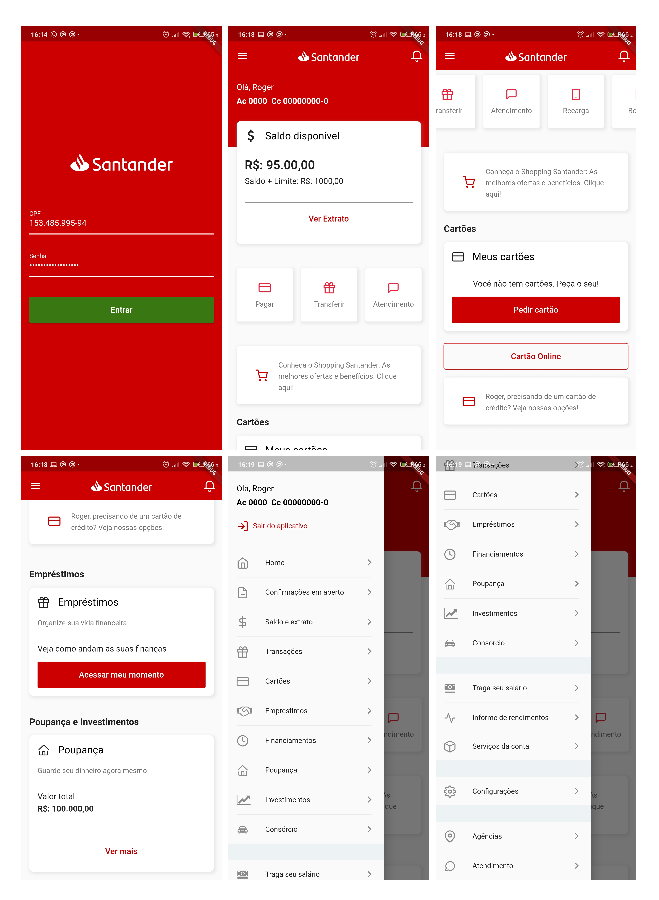

## :page_facing_up: Sobre
Estive muito tempo sem criar projetos em Flutter. Para aquecer-me novamente com esse framework, decidi copiar o layout de um aplicativo que utilizo constantemente, o [app do Santander](https://www.santander.com.br/atendimento-para-voce/app-santander). 

## :hammer: Instalação
```bash
# Clone este repositório
$ git clone https://github.com/rbmelolima/UI-Clone-Santander

# Entre na pasta raiz
$ cd UI-Clone-Santander

# Instale as dependências de projeto
$ flutter run pub get

# Inicie a aplicação (certifique-se de ter um aparelho mobile ou um emulador)
$ flutter run 
```

## :computer: Dependências
- [Flutter](https://flutter.dev/docs)
- [mask_text_input_formatter](https://pub.dev/packages/mask_text_input_formatter)
- [flutter_icons](https://pub.dev/packages/flutter_icons)
- [flutter_svg](https://pub.dev/packages/flutter_svg)

## :white_check_mark: Features
- [x] Página de login (Redesign)
- [x] Página inicial (Clone)

## :construction: Próximas features
- [ ] Ajustar fonte do aplicativo
- [ ] Cards expandíveis

## :link: Referências
[Santander Design Styleguide](https://www.google.com/url?sa=t&rct=j&q=&esrc=s&source=web&cd=&cad=rja&uact=8&ved=2ahUKEwicsPXamZ7sAhUDKLkGHVveA1AQFjAAegQIBBAC&url=https%3A%2F%2Fsantander-styleguide.herokuapp.com%2F&usg=AOvVaw11NSZvdvQigHgx9sE82_ro)
